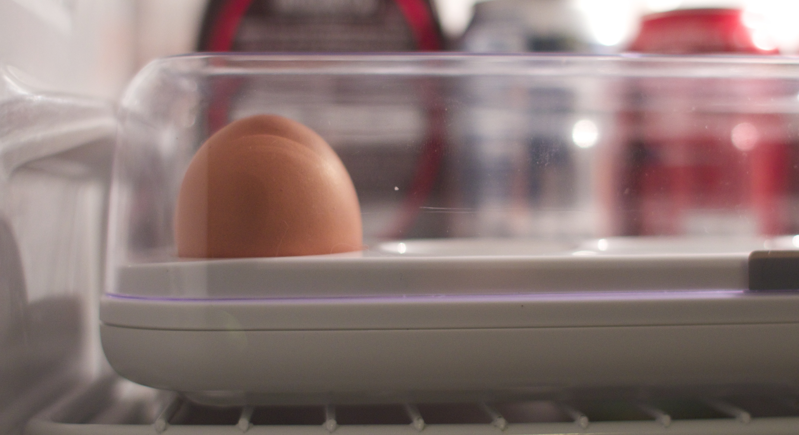

## Eggminder on SmartThings

Integrate the Internet of Eggs into SmartThings.

### Wink API in Beta

You'll need to have a client ID and secret from Quirky before you can get started - and since [the API is in beta right now](http://www.quirky.com/forums/topic/21462?page=7), you might have to wait a bit if you don't have those credentials yet. But hopefully there will be public signup soon!

### Setup

1. Go to [My Device Types](https://graph.api.smartthings.com/ide/devices) and [Add a New SmartDevice](https://graph.api.smartthings.com/ide/device/create)
2. Name it, enable the "Polling" capability, and add a "number" custom attribute. Create it, then replace the code with [eggminder.groovy](eggminder.groovy), and add in your client ID and client secret (the API is in beta right now, but I'll add a link to where you can get those when it's not)
4. Go [My Devices](https://graph.api.smartthings.com/device/list) and [Add a Device](https://graph.api.smartthings.com/device/create) – then choose the Eggminder device as the type.
5. Open up the app, tap on the new tile, and tap Preferences. Enter your Wink username (email) and password, and save. Then just pull down to refresh – now you know how many eggs you have!

### Why do we need the Internet of Eggs? 
If you're not already sold on the [Quirky Eggminder](http://www.quirky.com/shop/619), here's why you should be. It may not seem exciting that you no longer need to look in your fridge to see if you've got eggs - but imagine if your whole fridge knew what was in it? How [much milk it had](http://www.quirky.com/products/327-The-Milkmaid-smart-milk-jug)? How many eggs and how much milk were in that omlet you knew you could make? Or how many calories were in it?

It's exciting because it's the first step into a whole new area, the ordinary smart things. Because if your egg tray is connected, then the question stops being "why connect that thing?" and starts being "why isn't that thing connected?" 